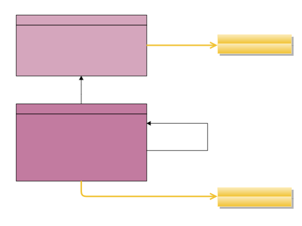

# SKOS-EP

This is the issue tracker for the maintenance of SKOS-EP.

SKOS-EP is an application profile of the [W3C Simple Knowledge Organization System (SKOS)](https://www.w3.org/TR/skos-reference/), designed and used for data of the European Parliament.

## Versions

- Latest version:
  - [HTML](./index.html)
  - [SHACL](./skos-ep.shacl.ttl)
- [Version 0.4](./0.4/)

## SKOS-EP at a glance

## Licence

SKOS-EP is distributed under the terms and conditions described in the [Creative Commons Attribution 4.0 International License (CC BY 4.0)](https://creativecommons.org/licenses/by/4.0/).
